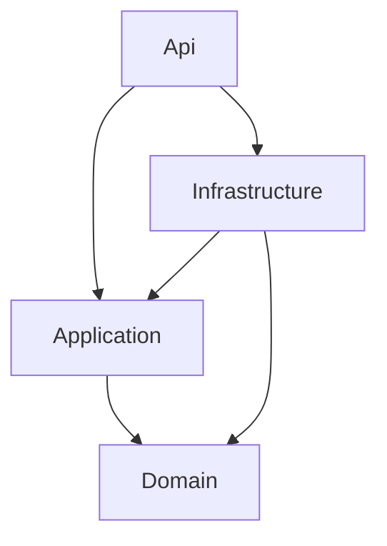

# DairyControl

Milk reception and quality-control backend for a small dairy plant, built with **.NET 10**, **Clean Architecture** and **Domain-Driven Design**.

> **Status:** backend complete (REST API, JWT authentication, error handling, unit tests). Angular client in progress.

## What it does

DairyControl registers milk suppliers (_proveedores_) and every delivery received at the plant (_recepción_): volume in liters, temperature, acidity, optional fat content, destination silo, timestamp and free-text notes.

The domain model is based on real reception logs from a dairy plant. All data in this repository is synthetic.

## Tech stack

- .NET 10, ASP.NET Core Web API
- Entity Framework Core 10 + SQL Server (LocalDB for development)
- JWT bearer authentication
- Swagger / OpenAPI (Swashbuckle)
- xUnit + Moq

## Architecture

Four layers, with dependencies pointing inward. Domain has no dependencies on any other project.



| Layer              | Responsibility                                                                                                      |
| ------------------ | ------------------------------------------------------------------------------------------------------------------- |
| **Domain**         | Entities, value objects, business rules, repository interfaces. No framework dependencies.                          |
| **Application**    | Use-case orchestration (`ProveedorAppService`, `AuthService`), DTOs, settings. Depends only on Domain abstractions. |
| **Infrastructure** | EF Core `DbContext`, Fluent API mappings, migrations, repository implementations.                                   |
| **Api**            | Controllers, middleware, dependency injection and pipeline setup (composition root).                                |

## Domain model

- **`Proveedor`** (aggregate root): the single entry point to the aggregate. Its recepciones are exposed read-only and can only be added through `RegistrarRecepcion`.
- **`RecepcionLeche`** (entity): a single delivery, owned by its `Proveedor`.
- **`ParametrosCalidad`** (value object, `record`): quality and volume measurements, validated at creation through a factory method.

## Key design decisions

- **Invariants live in the domain.** Factory methods, private constructors and private setters make invalid state impossible to construct, rather than relying on callers to validate.
- **One repository per aggregate.** `IProveedorRepository` is defined in Domain and implemented in Infrastructure (dependency inversion).
- **Owned types for the aggregate.** Recepciones are mapped with `OwnsMany` and quality parameters with `OwnsOne`. Recepciones have no `DbSet`, so they can't be queried or saved outside their aggregate.
- **Client-generated IDs.** The domain assigns its own `Guid` IDs and EF Core is configured with `ValueGeneratedNever()`, so new recepciones added to a loaded aggregate are inserted, not mistaken for existing rows.
- **Shared limits.** Constants such as maximum name length and decimal precision are defined once in the domain and reused by both validation and the database mapping.
- **Global exception middleware.** Domain validation errors (`ArgumentException`) return `400` with a JSON message. Any other exception returns a generic `500` without exposing internal details.
- **Secrets stay out of the repo.** The JWT signing key and admin password live in .NET User Secrets.

## API

| Method | Endpoint                            | Auth   | Description                                    |
| ------ | ----------------------------------- | ------ | ---------------------------------------------- |
| `POST` | `/api/Auth/login`                   | Public | Returns a signed JWT for valid credentials     |
| `POST` | `/api/Proveedores`                  | JWT    | Creates a proveedor                            |
| `GET`  | `/api/Proveedores/{id}`             | Public | Gets a proveedor by ID                         |
| `POST` | `/api/Proveedores/{id}/recepciones` | JWT    | Registers a recepción on an existing proveedor |

## Getting started

### Client (Angular)

Requires Node.js and the Angular CLI (`npm install -g @angular/cli`).

```bash
cd client
npm install
ng serve
```

The app runs at `http://localhost:4200`.

### Prerequisites

- .NET 10 SDK
- SQL Server LocalDB (included with Visual Studio) or SQL Server Express
- EF Core CLI: `dotnet tool install --global dotnet-ef`

### 1. Configure secrets

The admin username (`admin`) is in `appsettings.json`. The signing key and password must be set locally:

```bash
dotnet user-secrets set "Jwt:SigningKey" "<random string, at least 32 characters>" --project src/DairyControl.Api
dotnet user-secrets set "AdminUser:Password" "<your password>" --project src/DairyControl.Api
```

### 2. Create the database

```bash
dotnet ef database update --project src/DairyControl.Infrastructure --startup-project src/DairyControl.Api
```

### 3. Run the API

```bash
dotnet run --project src/DairyControl.Api
```

Swagger UI is available at `https://localhost:53008/swagger`. Call `POST /api/Auth/login`, copy the token, and paste it into the **Authorize** button to use the protected endpoints.

## Tests

```bash
dotnet test --solution DairyControl.slnx
```

10 unit tests, none of which touch a database:

- **Domain (5):** `ParametrosCalidad` validation, covering negative values, minimum volume, and optional fat content.
- **Application (5):** `ProveedorAppService` with a mocked repository (Moq), covering found and not-found paths, and verifying that persistence methods are called exactly as often as they should be.

## Development workflow

Every change is tracked as a GitHub Issue, implemented on a feature branch, and merged through a pull request that includes evidence (Swagger responses, database checks or test results).

## Roadmap

- [ ] Angular client: login, proveedores, recepción registration
- [ ] `GET /api/Proveedores` list endpoint and CORS configuration
- [x] CI with GitHub Actions
- [ ] Deployment
- [ ] Structured logging in the exception middleware
- [ ] Tests for `AuthService`
- [ ] Database-backed user accounts (only if multiple operators are needed)
